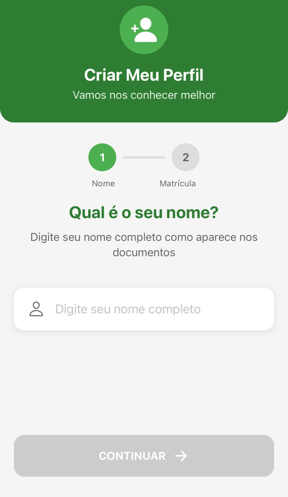
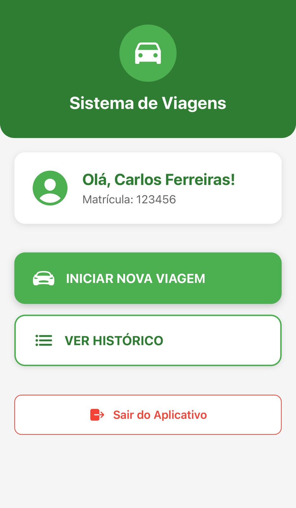
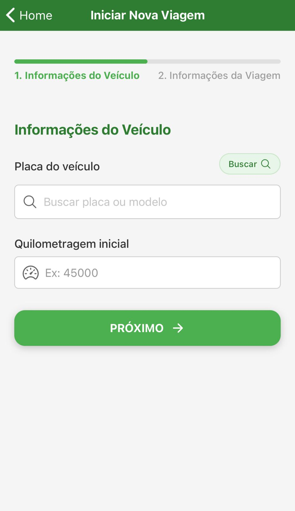
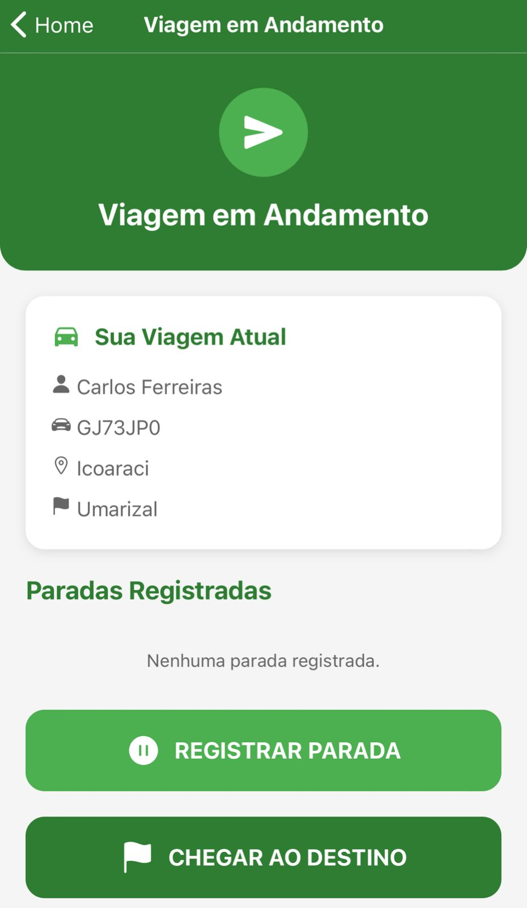
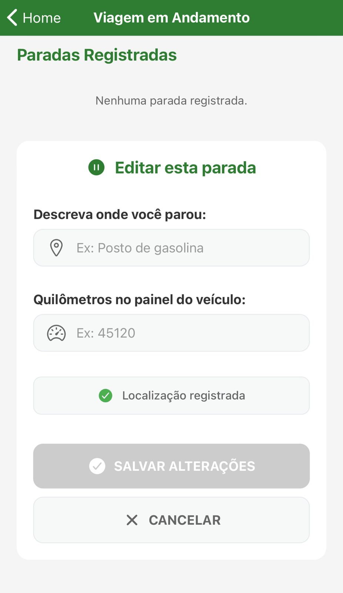
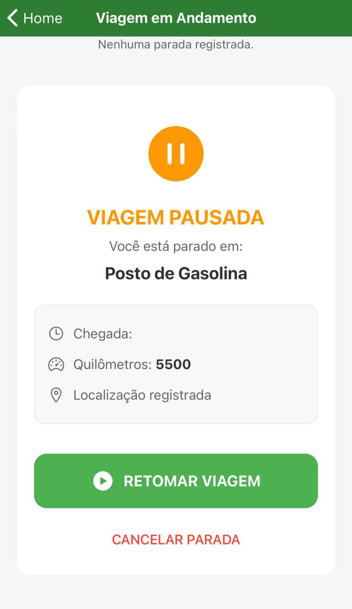
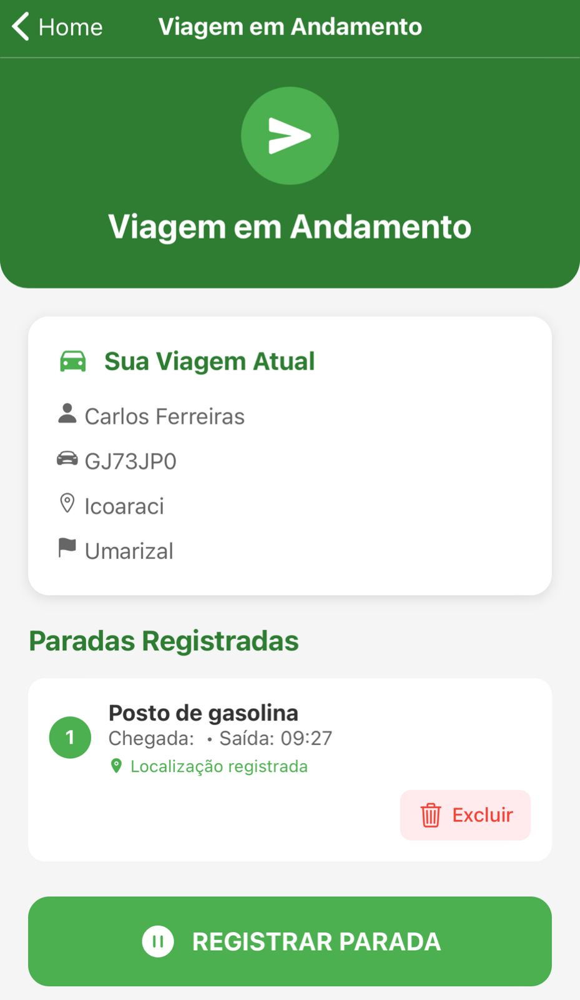
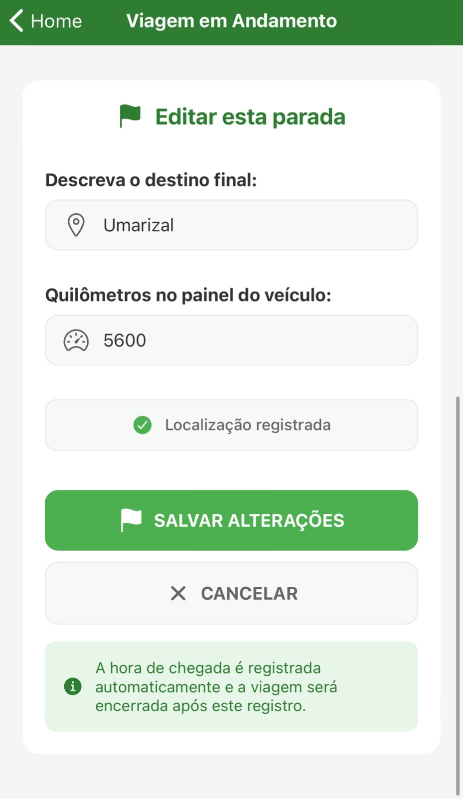
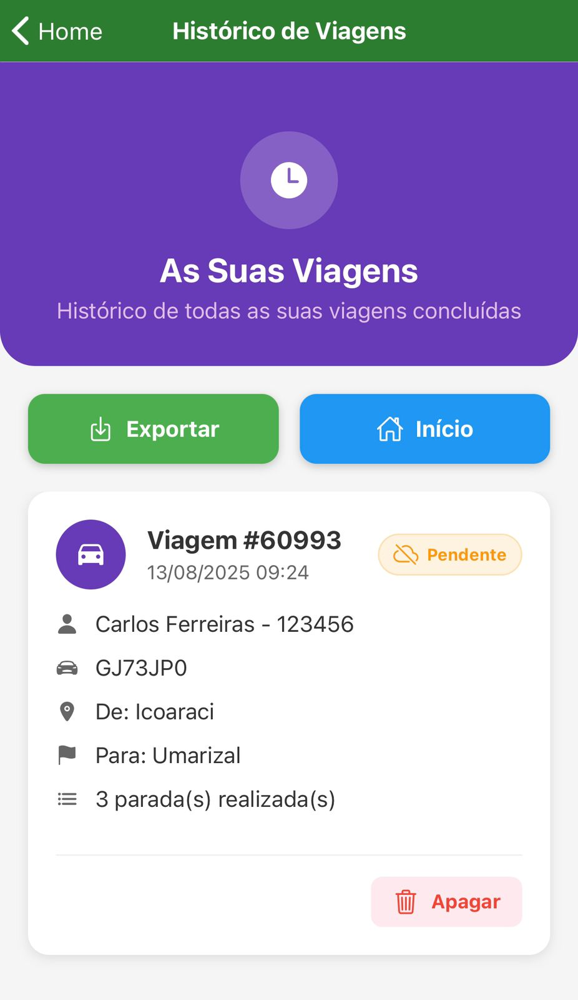

# 📌 RDM – Registro de Deslocamentos de Motoristas

## 1. Visão Geral
O **RDM** é um aplicativo desenvolvido para **monitorar e registrar corridas realizadas pelos motoristas da Cosanpa**, permitindo maior controle e fiscalização das viagens pela gerência.

O sistema é dividido em duas partes:
- **Aplicativo mobile** (usado pelos motoristas para registrar corridas)
- **Sistema web** (utilizado pela gestão para monitoramento em tempo real e análise posterior)

---

## 2. Objetivo
Garantir:
- Rastreabilidade das corridas realizadas
- Controle de quilometragem e destinos
- Registro de paradas
- Monitoramento em tempo real das viagens pela gerência

---

## 3. Público-Alvo
- Motoristas da Cosanpa
- Gestores e supervisores responsáveis pelo controle de frotas

---

## 4. Tecnologias Utilizadas
- **Front-end** (aplicativo mobile): React Native
- **Back-end** (sistema web e API): PHP + Laravel
- **API REST** para integração entre app e sistema web
- **Banco de dados** com cadastro de veículos e informações de cada carro

---

## 5. Fluxo de Uso
1. **Tela de Criar Usuário** – Cadastro do motorista no sistema.
2. **Tela de Abrir RDM (Iniciar Corrida)** – Registro do início da corrida.
3. **Tela de Informações da Corrida** – Preenchimento dos dados: ponto de partida, destino, quilometragem inicial e demais informações.
4. **Corrida em Andamento** – Registro de paradas e monitoramento em tempo real via sistema web.
5. **Histórico** – Consulta de corridas realizadas/finalizadas e exportação de dados.

---

## 6. Funcionalidades Principais
- Registro de corridas com quilometragem e destino
- Monitoramento em tempo real das paradas via sistema web
- Registro automático do horário de cada parada quando o motorista retoma a corrida
- Exportação do histórico de corridas finalizadas
- Integração via API com endpoints para envio e recebimento de dados
- Persistência local de informações para uso offline temporário
- Banco de dados com cadastro de veículos disponíveis

---

## 7. Dependências e Requisitos
- Dispositivo: Smartphone com Android (APK disponível para instalação)
- Conexão com a internet (necessária para sincronização em tempo real)

---

## 8. Instalação
1. Obter o arquivo **.apk** do RDM
2. Instalar no smartphone (ativar a opção de instalar apps de fontes desconhecidas, se necessário)
3. Abrir o app e realizar o cadastro/login

---

## 9. Manutenção e Atualizações
- Refinamento e refatoração do código conforme novas necessidades
- Correção de bugs
- Melhorias de desempenho e usabilidade

---

## 10. Observações Técnicas
- API construída com endpoints REST para comunicação entre app e sistema web
- Integração segura com autenticação de usuários
- Estrutura preparada para futuras expansões de funcionalidades

---

## 📸 Imagens do Aplicativo

> As imagens a seguir ilustram o fluxo real de uso do aplicativo.

| Tela Inicial | Criando Usuário |
|:---:|:---:|
|  |  |

| Abrir RDM | Informações da Viagem |
|:---:|:---:|
|  | 

| Viagem em Andamento | Adicionando Parada |
|:---:|:---:|
|  |  |

| Viagem Pausada | Corrida em Andamento com Parada |
|:---:|:---:|
|  |  |

| Finalizar Corrida | Histórico |
|:---:|:---:|
|  |  |

